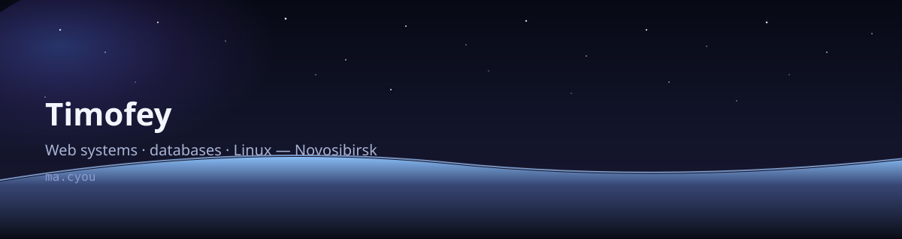

<!-- Profile README: Timofey / Mapagmataas1331 -->

  <picture>
    <source media="(prefers-color-scheme: dark)" srcset="./assets/banner-dark.svg" />
    <source media="(prefers-color-scheme: light)" srcset="./assets/banner-light.svg" />
    
  </picture>

<h2 align="center">Timofey · Mapagmataas</h2>

  I keep web systems alive — APIs, data, and the machines under them. 
  About three years at the Budker Institute of Nuclear Physics in Novosibirsk. 
  CV without the corporate fog.

  <a href="https://ma.cyou"><strong>ma.cyou</strong></a> ·
  <a href="https://me.ma.cyou"><strong>me.ma.cyou</strong></a> ·
  <a href="https://projects.ma.cyou"><strong>projects.ma.cyou</strong></a> ·
  <a href="https://chat.ma.cyou"><strong>chat.ma.cyou</strong></a>

---

### Stack

  
  
  
  
  
  
  
  
  
  
  
  

Also: systemd · Flask · Plotly · H.264 / Windows tooling where the job needs it.

### Featured projects

| Project | What it is |
| --- | --- |
| [chat.ma.cyou](https://chat.ma.cyou) | Invite-only messenger for direct and small group chats. Messages and files are encrypted in the browser before they leave the device. |
| [PocketCam](https://github.com/Mapagmataas1331/PocketCam) | Turns a phone browser into a Windows webcam on the same Wi-Fi, with nothing to install on the phone. |
| Reverse proxy and control plane | Go control plane for an Oracle Cloud host, with Caddy terminating TLS and routing HTTP, TCP, and UDP. |
| redis-grafana | Telemetry pipeline from a TCP source into Redis TimeSeries and Grafana dashboards. |
| db-configs | One workspace for several PostgreSQL databases, with a guarded edit mode and session rollback. |
| db-plots | Interactive time-series charts from PostgreSQL channels, with timezone-aware ranges. |

More write-ups on <a href="https://projects.ma.cyou">projects.ma.cyou</a>.

### GitHub

  <a href="https://github.com/Mapagmataas1331">
    <picture>
      <source media="(prefers-color-scheme: dark)" srcset="https://github-readme-stats.vercel.app/api?username=Mapagmataas1331&show_icons=true&hide_border=true&title_color=8b7cf6&icon_color=8b7cf6&text_color=c8cce0&bg_color=12141c" />
      
    </picture>
  </a>
  <a href="https://github.com/Mapagmataas1331">
    <picture>
      <source media="(prefers-color-scheme: dark)" srcset="https://github-readme-stats.vercel.app/api/top-langs/?username=Mapagmataas1331&layout=compact&hide_border=true&title_color=8b7cf6&text_color=c8cce0&bg_color=12141c" />
      
    </picture>
  </a>

Older widgets

  

### Contact

  <a href="mailto:me@ma.cyou">me@ma.cyou</a> ·
  <a href="https://t.me/mapagmataas">Telegram</a> ·
  <a href="https://youtube.com/@mapagmataas">YouTube</a> ·
  <a href="https://gist.github.com/Mapagmataas1331">gists</a>

